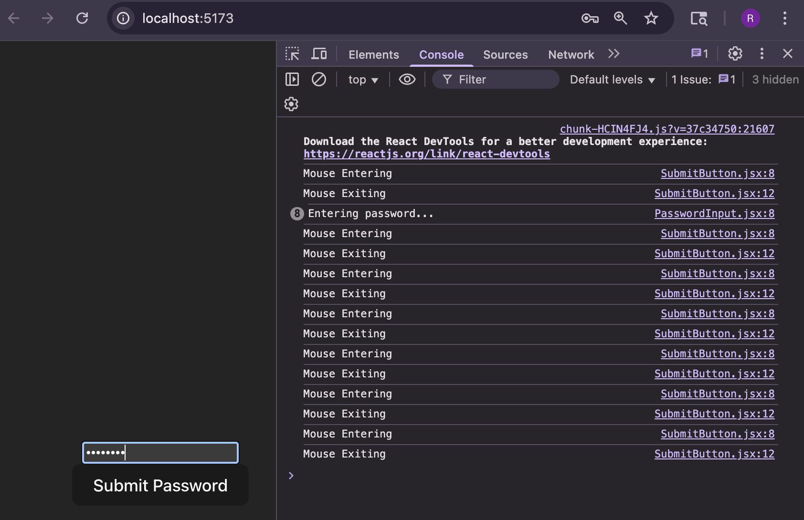

# React Event Handling Lab

This project demonstrates how to handle user events in React for anti-bot security measures. It includes two main components:
PasswordInput: A controlled <input type="password"> that logs every keystroke event.

SubmitButton: A <button> that logs mouse-enter and mouse-leave events.

## Table of Contents

- [Demo](#demo)  
- [Setup](#setup)  
- [Testing](#testing)  
- [Prerequisites](#prerequisites)
---

## Demo

## Setup
1. Clone the repo
2. `npm install`
3. `npm run dev` 
4. Follow link to view site

## Testing
- Run `npm test` 

## Prerequisites

Node.js v16 or higher

npm v8 or higher